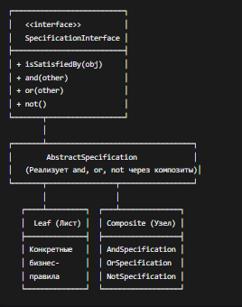
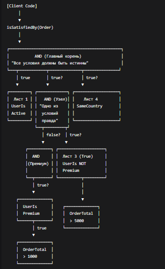
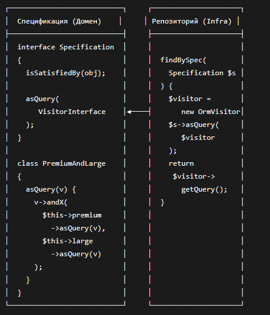

| Тип                   | Назначение                                             | Пример                   |
| --------------------- | ------------------------------------------------------ | ------------------------ |
| **Validation**        | Удовлетворяет ли объект критерию. Возвращает `bool`.   | `isSatisfiedBy()`        |
| **Selection/Query**   | Фильтрация набора объектов. Транслируется в SQL WHERE. | `asQuery()` для Doctrine |
| **Building to Order** | Описание требований к ещё не созданному объекту.       | Спецификация для фабрики |

