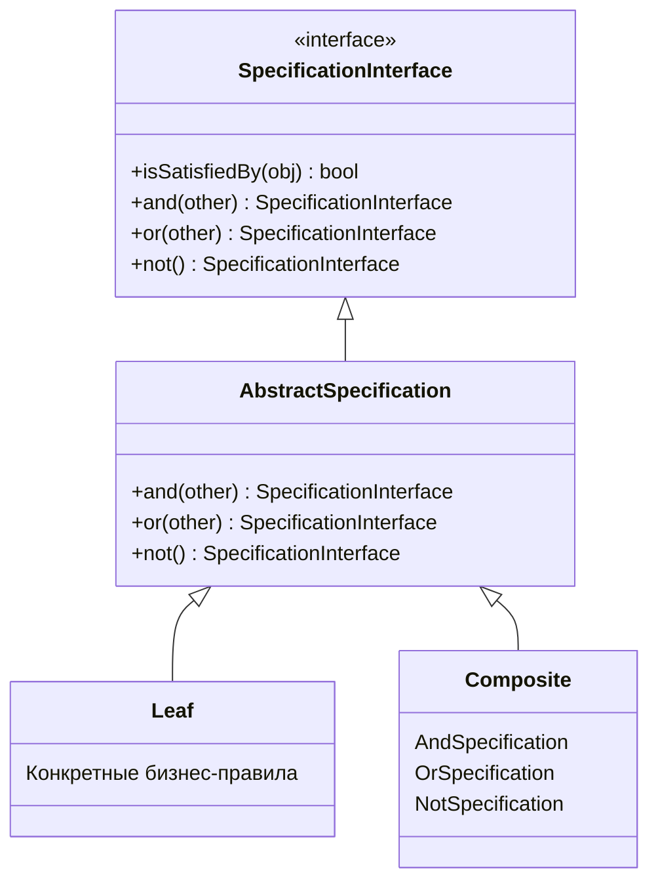
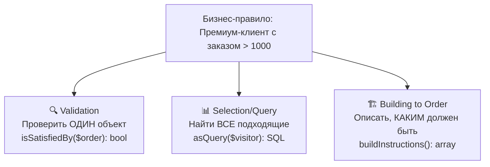
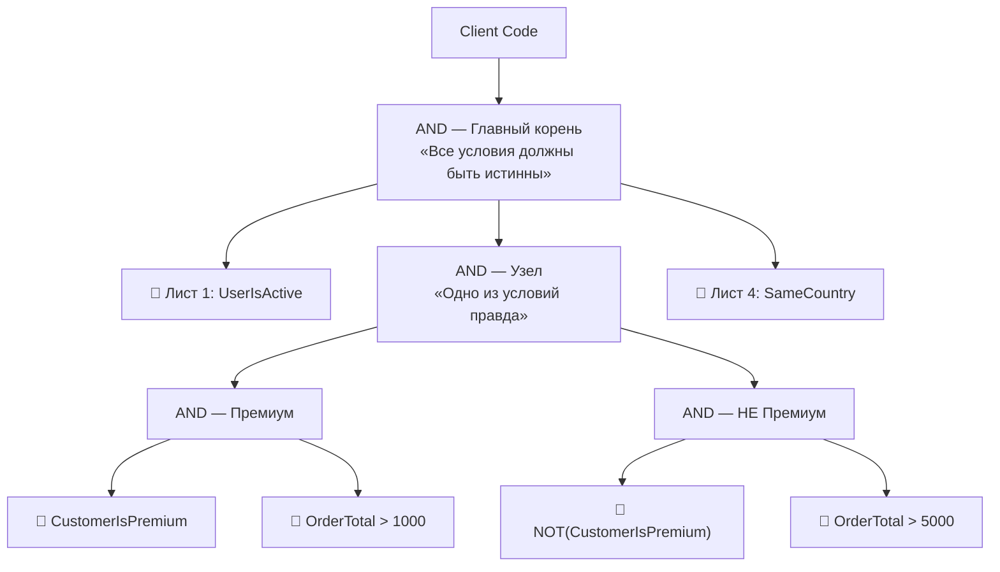

# Паттерн Specification в PHP 8.4

> **TL;DR:** Паттерн Specification инкапсулирует бизнес-правила в отдельные объекты, которые можно комбинировать как кубики LEGO с помощью AND, OR, NOT. Это превращает процедурную лапшу из `if` в декларативное описание правил предметной области.

---

## Содержание

- [[#Часть 1. Проблема]]
- [[#Часть 2. История и решение]]
- [[#Часть 3. Три лица паттерна]]
- [[#Часть 4. Код — Интерфейс и ядро]]
- [[#Часть 5. Код — Конкретные правила листья]]
- [[#Часть 6. Код — Адаптация типов]]
- [[#Часть 7. Код — Сборка дерева]]
- [[#Часть 8. Код — Очищенный сервис]]
- [[#Часть 9. Как работает isSatisfiedBy]]
- [[#Часть 10. Почему mixed]]
- [[#Часть 11. Когда использовать модель когда Specification]]
- [[#Часть 12. Query Mode и Building to Order]]
- [[#Часть 13. Тёмная сторона и лучшие практики]]
- [[#Часть 14. Аналоги и альтернативы]]
- [[#Часть 15. Структура проекта]]
- [[#Часть 16. Заключение]]

---

## Часть 1. Проблема

Начну с боли, которая знакома каждому. Откройте любой долгоживущий проект и найдите класс с бизнес-логикой. Скорее всего, вы увидите нечто подобное.

### ❌ Проблемный код: ShippingService

> [!warning]- Развернуть проблемный код
> ```php
> <?php
> 
> declare(strict_types=1);
> 
> namespace App\Service;
> 
> use App\Entity\Order;
> use App\Entity\User;
> use App\Repository\OrderRepository;
> 
> class ShippingService
> {
>     public function __construct(
>         private readonly OrderRepository $orderRepository,
>     ) {}
> 
>     public function canShip(Order $order): bool
>     {
>         // Проверка 1: Пользователь должен быть активен
>         if ($order->getUser()?->getStatus() !== User::STATUS_ACTIVE) {
>             return false;
>         }
> 
>         // Проверка 2: Email должен быть подтвержден
>         if (!$order->getUser()?->isEmailVerified()) {
>             return false;
>         }
> 
>         // Проверка 3: Заказ не отменен и не доставлен ранее
>         if ($order->getStatus() === Order::STATUS_CANCELLED 
>             || $order->getStatus() === Order::STATUS_DELIVERED) {
>             return false;
>         }
> 
>         // Проверка 4: Только для премиум-клиентов с суммой > 1000
>         if ($order->getUser()?->getTier() === User::TIER_PREMIUM 
>             && $order->getTotal() > 1000) {
>             return true;
>         }
> 
>         // Проверка 5: Базовая доставка для обычных пользователей при сумме > 5000
>         if ($order->getUser()?->getTier() !== User::TIER_PREMIUM 
>             && $order->getTotal() > 5000) {
>             return true;
>         }
> 
>         // Проверка 6: Склад должен быть в той же стране
>         if ($order->getWarehouse()?->getCountry() !== $order->getShippingAddress()?->getCountry()) {
>             return false;
>         }
> 
>         return false;
>     }
> 
>     public function ship(Order $order): void
>     {
>         if (!$this->canShip($order)) {
>             throw new \DomainException('Order cannot be shipped due to business rules.');
>         }
>         
>         $order->setStatus(Order::STATUS_SHIPPING);
>         $this->orderRepository->save($order);
>     }
> }
> ```

### Четыре всадника апокалипсиса такого кода

> [!failure] **1. Нарушение Single Responsibility**
> Сервис знает всё: статусы пользователей, правила лояльности, логистику складов, проверку email.

> [!failure] **2. Хрупкость**
> Добавьте проверку веса заказа или новый уровень пользователя — и метод превратится в кашу, которую страшно рефакторить.

> [!failure] **3. Невозможность переиспользования**
> Правило «Премиум с суммой > 1000» понадобилось в `InvoiceService`? Копипаст. «Email подтвержден» нужно для отзывов? Снова копипаст.

> [!failure] **4. Сложность тестирования**
> Чтобы покрыть этот метод, нужны десятки моков с разной комбинацией флагов.

### Представьте пятницу вечером

Бизнес говорит: *«Хочу новое правило — VIP-клиенты с суммой от 500 или обычные от 2000 в праздничный период, но только если склад не в Китае»*

С этим кодом вы обречены.

---

## Часть 2. История и решение

### Происхождение

> [!info] Эрик Эванс, «Domain-Driven Design» (2003)
> Паттерн Specification описан в культовой книге Эрика Эванса. Идея проста и гениальна: **инкапсулировать бизнес-правило в отдельный объект-предикат** с методом `isSatisfiedBy($candidate): bool`.

Спецификация говорит не *как* объект это делает, а *что* проверяет. Это позволяет комбинировать бизнес-правила с помощью булевой логики (AND, OR, NOT) как кубики LEGO.

### Паттерн реализует вариацию Composite (Компоновщик)



Клиенту безразлично, работает он с одним правилом или сотней.

---

## Часть 3. Три лица паттерна

Под именем «Specification» скрываются три разных, хотя и связанных, концепта:

| Тип | Назначение | Возвращает |
|-----|-----------|------------|
| **Validation** | Удовлетворяет ли объект критерию? | `bool` |
| **Selection / Query** | Найти все подходящие объекты (трансляция в SQL) | Критерий для ORM |
| **Building to Order** | Описать требования к ещё не созданному объекту | Инструкции для фабрики |

### Связь между тремя лицами



> [!important] Одно бизнес-правило — три режима использования
> Бизнес-правило живёт **один раз** в доменном слое, а инфраструктура адаптирует его под свои нужды: память, база данных или фабрика объектов.

Сегодня мы фокусируемся на **Validation**, но упомянем и остальные режимы.

---

## Часть 4. Код — Интерфейс и ядро

### Контракт

> [!note] Файл: `src/Specification/Contract/SpecificationInterface.php`

```php
<?php

declare(strict_types=1);

namespace App\Specification\Contract;

/**
 * @template C
 */
interface SpecificationInterface
{
    public function isSatisfiedBy(mixed $candidate): bool;
    
    public function and(SpecificationInterface $other): SpecificationInterface;
    
    public function or(SpecificationInterface $other): SpecificationInterface;
    
    public function not(): SpecificationInterface;
}
```

### Абстрактный класс

> [!note] Файл: `src/Specification/Core/AbstractSpecification.php`

```php
<?php

declare(strict_types=1);

namespace App\Specification\Core;

use App\Specification\Contract\SpecificationInterface;

abstract readonly class AbstractSpecification implements SpecificationInterface
{
    public function and(SpecificationInterface $other): SpecificationInterface
    {
        return new AndSpecification($this, $other);
    }

    public function or(SpecificationInterface $other): SpecificationInterface
    {
        return new OrSpecification($this, $other);
    }

    public function not(): SpecificationInterface
    {
        return new NotSpecification($this);
    }
}
```

### Композиты

Все композиты — `final readonly`. Иммутабельность здесь критична.

> [!note] Файл: `src/Specification/Core/AndSpecification.php`

```php
<?php

declare(strict_types=1);

namespace App\Specification\Core;

use App\Specification\Contract\SpecificationInterface;

final readonly class AndSpecification extends AbstractSpecification
{
    public function __construct(
        private SpecificationInterface $left,
        private SpecificationInterface $right,
    ) {}

    public function isSatisfiedBy(mixed $candidate): bool
    {
        return $this->left->isSatisfiedBy($candidate) 
            && $this->right->isSatisfiedBy($candidate);
    }
}
```

> [!note] Файл: `src/Specification/Core/OrSpecification.php`

```php
<?php

declare(strict_types=1);

namespace App\Specification\Core;

use App\Specification\Contract\SpecificationInterface;

final readonly class OrSpecification extends AbstractSpecification
{
    public function __construct(
        private SpecificationInterface $left,
        private SpecificationInterface $right,
    ) {}

    public function isSatisfiedBy(mixed $candidate): bool
    {
        return $this->left->isSatisfiedBy($candidate) 
            || $this->right->isSatisfiedBy($candidate);
    }
}
```

> [!note] Файл: `src/Specification/Core/NotSpecification.php`

```php
<?php

declare(strict_types=1);

namespace App\Specification\Core;

use App\Specification\Contract\SpecificationInterface;

final readonly class NotSpecification extends AbstractSpecification
{
    public function __construct(
        private SpecificationInterface $specification,
    ) {}

    public function isSatisfiedBy(mixed $candidate): bool
    {
        return !$this->specification->isSatisfiedBy($candidate);
    }
}
```

---

## Часть 5. Код — Конкретные правила (листья)

Каждое правило — чистый, самодостаточный объект.

### Спецификации для Order

> [!note] Файл: `src/Specification/Order/OrderTotalGreaterThanSpecification.php`

```php
<?php

declare(strict_types=1);

namespace App\Specification\Order;

use App\Entity\Order;
use App\Specification\Core\AbstractSpecification;

final readonly class OrderTotalGreaterThanSpecification extends AbstractSpecification
{
    public function __construct(
        private float $minTotal
    ) {}

    public function isSatisfiedBy(mixed $candidate): bool
    {
        return $candidate instanceof Order 
            && $candidate->total > $this->minTotal;
    }
}
```

> [!note] Файл: `src/Specification/Order/CustomerIsPremiumSpecification.php`

```php
<?php

declare(strict_types=1);

namespace App\Specification\Order;

use App\Entity\Order;
use App\Entity\User;
use App\Specification\Core\AbstractSpecification;

final readonly class CustomerIsPremiumSpecification extends AbstractSpecification
{
    public function isSatisfiedBy(mixed $candidate): bool
    {
        return $candidate instanceof Order
            && $candidate->user?->tier === User::TIER_PREMIUM;
    }
}
```

> [!note] Файл: `src/Specification/Order/SameCountrySpecification.php`

```php
<?php

declare(strict_types=1);

namespace App\Specification\Order;

use App\Entity\Order;
use App\Specification\Core\AbstractSpecification;

final readonly class SameCountrySpecification extends AbstractSpecification
{
    public function isSatisfiedBy(mixed $candidate): bool
    {
        return $candidate instanceof Order
            && $candidate->warehouse?->country === $candidate->shippingAddress?->country;
    }
}
```

### Спецификации для User

> [!note] Файл: `src/Specification/User/EmailIsVerifiedSpecification.php`

```php
<?php

declare(strict_types=1);

namespace App\Specification\User;

use App\Entity\User;
use App\Specification\Core\AbstractSpecification;

final readonly class EmailIsVerifiedSpecification extends AbstractSpecification
{
    public function isSatisfiedBy(mixed $candidate): bool
    {
        return $candidate instanceof User 
            && $candidate->isEmailVerified();
    }
}
```

> [!note] Файл: `src/Specification/User/UserIsActiveSpecification.php`

```php
<?php

declare(strict_types=1);

namespace App\Specification\User;

use App\Entity\User;
use App\Specification\Core\AbstractSpecification;

final readonly class UserIsActiveSpecification extends AbstractSpecification
{
    public function isSatisfiedBy(mixed $candidate): bool
    {
        return $candidate instanceof User 
            && $candidate->status === User::STATUS_ACTIVE;
    }
}
```

---

## Часть 6. Код — Адаптация типов

> [!warning] Проблема несовместимости типов
> `UserIsActiveSpecification` ожидает `User`, но `OrderCanBeShippedSpecification` будет принимать `Order`. Нам нужен адаптер — спецификация, которая извлекает `User` из `Order` и делегирует проверку.

> [!note] Файл: `src/Specification/Core/AdaptSpecification.php`

```php
<?php

declare(strict_types=1);

namespace App\Specification\Core;

use App\Specification\Contract\SpecificationInterface;

/**
 * Универсальный адаптер для трансформации кандидата
 * 
 * @template CFrom
 * @template CTo
 */
final readonly class AdaptSpecification extends AbstractSpecification
{
    /**
     * @param SpecificationInterface<CTo> $inner
     * @param callable(CFrom): (CTo|null) $extractor
     */
    public function __construct(
        private SpecificationInterface $inner,
        private mixed $extractor,
    ) {}

    public function isSatisfiedBy(mixed $candidate): bool
    {
        $innerCandidate = ($this->extractor)($candidate);
        
        return $innerCandidate !== null 
            && $this->inner->isSatisfiedBy($innerCandidate);
    }
}
```

---

## Часть 7. Код — Сборка дерева

### Дерево решений для доставки



### Композитная спецификация

> [!note] Файл: `src/Specification/Order/Composite/OrderCanBeShippedSpecification.php`

```php
<?php

declare(strict_types=1);

namespace App\Specification\Order\Composite;

use App\Entity\Order;
use App\Entity\User;
use App\Specification\Contract\SpecificationInterface;
use App\Specification\Core\AbstractSpecification;
use App\Specification\Core\AdaptSpecification;
use App\Specification\Order\CustomerIsPremiumSpecification;
use App\Specification\Order\OrderTotalGreaterThanSpecification;
use App\Specification\Order\SameCountrySpecification;
use App\Specification\User\EmailIsVerifiedSpecification;
use App\Specification\User\UserIsActiveSpecification;

final readonly class OrderCanBeShippedSpecification extends AbstractSpecification
{
    public SpecificationInterface $rule;

    public function __construct()
    {
        $this->rule = $this->buildRule();
    }

    public function isSatisfiedBy(mixed $candidate): bool
    {
        return $this->rule->isSatisfiedBy($candidate);
    }

    private function buildRule(): SpecificationInterface
    {
        // Адаптируем User-спецификации для работы с Order
        $extractUser = static fn(Order $order): ?User => $order->user;

        $userIsActive = new AdaptSpecification(
            new UserIsActiveSpecification(), 
            $extractUser
        );

        $emailIsVerified = new AdaptSpecification(
            new EmailIsVerifiedSpecification(), 
            $extractUser
        );

        return $userIsActive
            ->and($emailIsVerified)
            ->and(new SameCountrySpecification())
            ->and(
                (new CustomerIsPremiumSpecification())
                    ->and(new OrderTotalGreaterThanSpecification(1000))
                    ->or(
                        (new CustomerIsPremiumSpecification())->not()
                            ->and(new OrderTotalGreaterThanSpecification(5000))
                    )
            );
    }
}
```

---

## Часть 8. Код — Очищенный сервис

> [!note] Файл: `src/Service/ShippingServiceRefactored.php`

```php
<?php

declare(strict_types=1);

namespace App\Service;

use App\Entity\Order;
use App\Repository\OrderRepository;
use App\Specification\Order\Composite\OrderCanBeShippedSpecification;

final readonly class ShippingServiceRefactored
{
    public function __construct(
        private OrderRepository $orderRepository,
        private OrderCanBeShippedSpecification $shippingRule,
    ) {}

    public function ship(Order $order): void
    {
        if (!$this->shippingRule->isSatisfiedBy($order)) {
            throw new \DomainException(
                'Order cannot be shipped due to business constraints.'
            );
        }

        $order->setStatus(Order::STATUS_SHIPPING);
        $this->orderRepository->save($order);
    }
}
```

> [!success] Сравнение: Было → Стало
> **Было:** 40+ строк нечитаемых условий в одном методе.
> **Стало:** Сервис из 10 строк, который просто спрашивает разрешение у дерева спецификаций.

---

## Часть 9. Как работает `isSatisfiedBy`

Разберем пошаговую трассировку для конкретного заказа.

### Исходные данные

```php
$order = new Order(
    user: new User(tier: 'basic', status: 'active', emailVerified: true),
    total: 6000,
    warehouse: new Warehouse(country: 'RU'),
    shippingAddress: new Address(country: 'RU'),
);

$result = $shippingRule->isSatisfiedBy($order);
```

### Пошаговая трассировка

> [!abstract] **Шаг 1. Корневой AND**
> Вызывает левую часть первой (short-circuit evaluation).

> [!abstract] **Шаг 2. AdaptSpecification для UserIsActive**
> Извлекает `User` из `Order` через `fn(Order $order) => $order->user`.
> Вызывает `UserIsActiveSpecification->isSatisfiedBy($user)`.
> `$user->status === 'active'` → **✅ TRUE**

> [!abstract] **Шаг 3. AdaptSpecification для EmailIsVerified**
> Тот же пользователь.
> `$user->isEmailVerified()` → **✅ TRUE**

> [!abstract] **Шаг 4. SameCountrySpecification**
> `$order->warehouse->country === $order->shippingAddress->country`
> `'RU' === 'RU'` → **✅ TRUE**

> [!abstract] **Шаг 5. Узел OR**
> - Левая ветка (Премиум AND > 1000): `CustomerIsPremium` → **FALSE** (tier = basic). Short-circuit. ❌
> - Правая ветка (НЕ Премиум AND > 5000):
>   - `NOT(CustomerIsPremium)` → **TRUE** ✅
>   - `OrderTotal > 5000` → `6000 > 5000` → **TRUE** ✅
> - Узел OR возвращает **TRUE** ✅

> [!abstract] **Шаг 6. Корневой AND — финал**
> Все три ветки вернули TRUE → **✅ TRUE**. `canShip = true`.

### Композиты — слепые проводники

> [!tip] Аналогия с почтальоном
> Представьте почтальона. Он не вскрывает конверты и не проверяет, кому адресовано письмо. Его задача — доставить конверт адресату. Так и `AndSpecification`: он **транзитом** передаёт кандидата дальше, не зная и не желая знать, что внутри.

---

## Часть 10. Почему `mixed`?

### Три причины

> [!info] **1. Контракт не знает будущего**
> Интерфейс пишется сегодня, а спецификации для `Order`, `User`, `string`, `UploadedFile` появятся завтра.

> [!info] **2. Композиты — слепые проводники**
> `AndSpecification` не должен знать тип кандидата. Он просто передаёт его дальше.

> [!info] **3. Историческая причина (PHP < 7.4)**
> До ковариантности параметров вы физически не могли сузить тип в дочернем классе.

### Решения

```php
// 1. Дженерики через phpDoc (PHPStan понимает)
/**
 * @template C
 * @extends AbstractSpecification<Order>
 */

// 2. Проверка типа внутри (fail fast)
if (!$candidate instanceof Order) {
    throw new \InvalidArgumentException('Expected Order');
}

// 3. Обёртка с конкретным типом для внешнего API
public function check(Order $order): bool
{
    return $this->isSatisfiedBy($order);
}
```

> [!check] Главная мысль
> **`mixed` — это не баг, а фича. Это осознанная плата за то, что композитное дерево может обрабатывать ЛЮБОЙ тип данных, не зная о нём ничего.**

---

## Часть 11. Когда использовать модель, а когда Specification?

### Спектр решений

```
Простое правило ──────────────────────────────► Сложное правило
Один контекст                                  Много контекстов
Не меняется                                   Часто меняется
Принадлежит сущности                           Зависит от нескольких сущностей
    │                                               │
    ▼                                               ▼
Метод на сущности                            Specification Pattern
$order->isLarge()                     (new LargeOrderSpec())->and(...)
```

### Когда правило должно быть в модели

```php
final class Order
{
    // ✅ Использует только свои поля
    public function isLarge(): bool 
    {
        return $this->total > 5000;
    }

    // ✅ Инвариант сущности
    public function canBeCancelled(): bool 
    {
        return $this->status === OrderStatus::PENDING;
    }
}
```

### Когда правило должно быть Specification

```php
// ✅ Зависит от нескольких сущностей
(new CustomerIsPremiumSpecification())
    ->and(new OrderTotalGreaterThanSpecification(1000))

// ✅ Переиспользуется в разных контекстах
// - ShippingService
// - DiscountService
// - ReportService
```

### Правило трёх вопросов

> [!important] Алгоритм принятия решения
> 1. Правило использует **ТОЛЬКО** поля этой сущности?
>    - Да → вопрос 2
>    - Нет → **Specification**
> 2. Правило переиспользуется в **ДРУГОМ** сервисе/контексте?
>    - Да → **Specification**
>    - Нет → вопрос 3
> 3. Правило выражает **ИНВАРИАНТ** сущности?
>    - Да → **Метод на сущности**
>    - Нет → **Specification**

| Критерий | Метод на сущности | Specification |
|----------|:---:|:---:|
| Зависит только от полей сущности | ✅ | ⚠️ Избыточно |
| Зависит от нескольких сущностей | ❌ | ✅ |
| Нужен в одном контексте | ✅ | ⚠️ Избыточно |
| Нужен в 3+ контекстах | ❌ | ✅ |
| Часто меняется логика | ❌ | ✅ |
| Комбинируется с другими правилами | ❌ | ✅ |
| Выражает инвариант сущности | ✅ | ❌ |

---

## Часть 12. Query Mode и Building to Order

### Selection / Query Mode

> [!info] Схема двойной диспетчеризации
> 
> ```
> Спецификация (Домен)          Репозиторий (Infra)
> ┌──────────────────┐          ┌──────────────────┐
> │ PremiumAndLarge  │          │ findBySpec($spec)│
> │                  │          │                  │
> │ asQuery(         │◄─────────│ $visitor =        │
> │   VisitorInterface│          │   new OrmVisitor │
> │ )                │          │ $spec->asQuery(   │
> │                  │          │   $visitor        │
> │ v->andX(         │          │ )                 │
> │   premiumPart,   │          │                  │
> │   largePart      │          │ $visitor->        │
> │ )                │          │   getQuery()      │
> └──────────────────┘          └──────────────────┘
> ```

Спецификации ничего не знают о SQL. Визитёр ничего не знает о бизнес-правилах.

### Building to Order (редкий режим)

```php
// Промо-акция: "Премиум-клиенты получают бесплатный подарок"

// Шаг 1: Selection — ищем существующий
$existingGift = $repo->findOneBySpec(new GiftForPremiumSpec($user));

// Шаг 2: Building — создаём, если не нашли
if (!$existingGift) {
    $giftOrder = $factory->buildFromSpec(new GiftForPremiumSpec($user));
    // Создаёт Order(type: GIFT, total: 0, status: AWAITING)
}
```

---

## Часть 13. Тёмная сторона и лучшие практики

> [!warning] Критика паттерна

**1. Оверинжиниринг**
Если правило «сумма > 0» используется один раз — создание класса Specification это перебор. Паттерн для **переиспользуемых и изменчивых** правил.

**2. Анемия модели**
Критики говорят: правила должны быть в самих сущностях. `$order->canBeShipped()` вместо `$spec->isSatisfiedBy($order)`. В простых случаях они правы.

**3. Сложность отладки**
Дерево из 15 вложенных спецификаций сложнее дебажить, чем плоский список IF. Решение: логировать путь прохождения или добавить метод `explain()`.

### Когда использовать

| Ситуация | Решение |
|----------|---------|
| Правило одноразовое | `if` в сервисе |
| Правило в одном контексте | `private` метод |
| Правило в разных контекстах | **Specification** |
| Правило часто меняется / комбинируется | **Specification + Composite** |
| Только фильтрация БД | Doctrine Criteria API |

---

## Часть 14. Аналоги и альтернативы

| Инструмент | Плюсы | Минусы |
|-----------|-------|--------|
| **Policy (Strategy)** | Инкапсулирует действия, а не проверки | Другой паттерн |
| **Hard-coded методы репозитория** | Простота, доменные имена | Комбинаторный взрыв методов |
| **Doctrine Criteria** | Из коробки, SQL и in-memory | Ограниченная гибкость, нет JOIN |
| **Query Objects** | Явный нейминг, изоляция | Экспоненциальный рост классов |
| **Expression Trees** | Лаконичность (лямбды) | Сложная трансляция в SQL |
| **Библиотеки** | Готовый код | Внешняя зависимость |

---

## Часть 15. Структура проекта

```
php-specification-pattern/
├── src/
│   ├── Entity/
│   │   ├── Order.php
│   │   ├── User.php
│   │   ├── Warehouse.php
│   │   └── Address.php
│   ├── Specification/
│   │   ├── Contract/
│   │   │   └── SpecificationInterface.php
│   │   ├── Core/
│   │   │   ├── AbstractSpecification.php
│   │   │   ├── AndSpecification.php
│   │   │   ├── OrSpecification.php
│   │   │   ├── NotSpecification.php
│   │   │   └── AdaptSpecification.php
│   │   ├── Order/
│   │   │   ├── CustomerIsPremiumSpecification.php
│   │   │   ├── OrderTotalGreaterThanSpecification.php
│   │   │   ├── SameCountrySpecification.php
│   │   │   └── Composite/
│   │   │       └── OrderCanBeShippedSpecification.php
│   │   └── User/
│   │       ├── EmailIsVerifiedSpecification.php
│   │       └── UserIsActiveSpecification.php
│   └── Service/
│       ├── ShippingService.php           ❌ Проблемный
│       └── ShippingServiceRefactored.php ✅ Очищенный
├── tests/
│   └── Specification/
│       └── OrderCanBeShippedTest.php
├── README.md
├── LICENSE
└── composer.json
```

---

## Часть 16. Заключение

> [!success] Главная мысль доклада
> 
> Паттерн Specification — это не серебряная пуля. Это инструмент перехода от процедурного мышления **«как проверить»** к декларативному **«что проверить»**.

### Что вы получаете

- ✅ Бизнес-правила становятся гражданами первого класса
- ✅ Их можно именовать, тестировать, переиспользовать и комбинировать
- ✅ При изменениях требований вы собираете новое дерево из существующих кубиков
- ✅ Сервисный слой очищается от процедурной лапши

### Что нужно помнить

- ⚠️ Не применяйте для одноразовых правил
- ⚠️ Не заменяйте инварианты сущностей
- ⚠️ Помните о сложности отладки глубоких деревьев

---

> [!quote] Финальный совет
> Когда бизнес в пятницу вечером скажет про новое условие доставки, вы не полезете в дебри `ShippingService`, а просто соберёте новое дерево из существующих кубиков.
